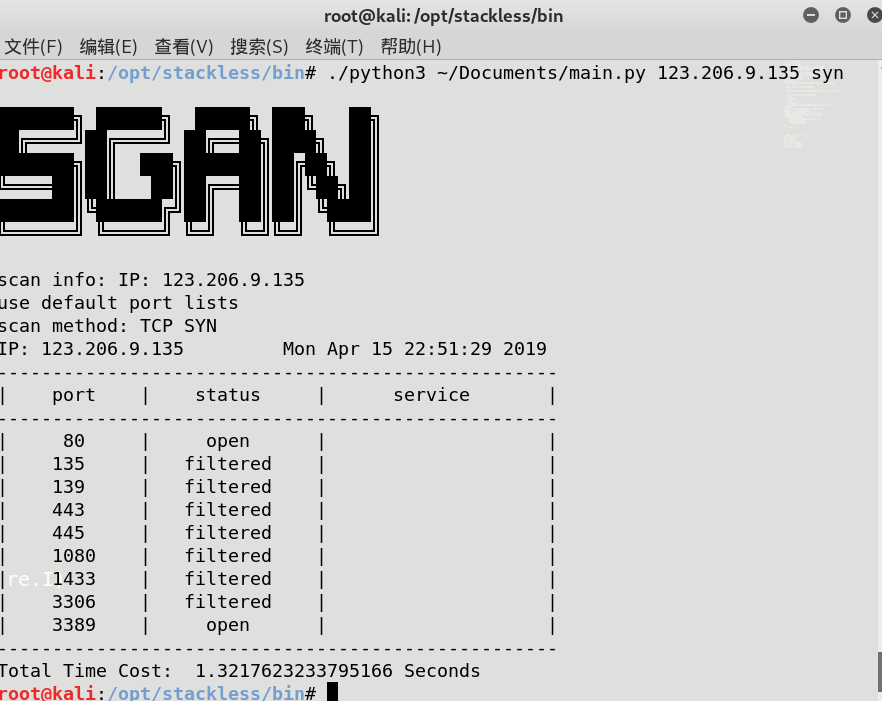

# Sgan（一个小轮子）

## A simple port scanner with funny functions.

## 一个简单的端口扫描软件，附带杂七杂八的功能。

## 方法：

1. `git clone https://github.com/marktreyvon/Sgan.git` 
2. `python Sgan.py -h`

## 软件环境：Kali_2018.4_amd64 + Python3 +stackless Python（暂不支持Windows）

### Python 库：requests,bs4(BeautifulSoup)

**Kali 默认没有安装stackless python，需要自行配置。**

## 致谢：

- [PortScanner](https://github.com/se55i0n/PortScanner)  
- [FuzzScanner](https://github.com/TideSec/FuzzScanner)

### 已实现：

- TCP扫描
  - connect（）
  - SYN
- UDP扫描
- 基于Stackless Python 的端口扫描Python多线程实现
- whois查询
- CDN检测
- 敏感文件/目录探测（性能较差，慎用）
- ……
主要文件都已在文件首标出。
### 运行效果：

    

    

    

## 遇到的问题：
1. Windows系统不支持通过socket.PF_PACKET从数据链路层获取数据包，需要另寻他法。这意味着SYN扫描在Windows上不能得到正确的结果
2. Windows系统并不完全遵守RFC793，这意味着NULL、FIN扫描Windows得不到正确的/准确的结果；并且UDP扫描不会发送ICMP端口不可达消息；
3. 端口扫描有一定误报率，次数少结果不确定，次数多容易ban IP；
4. TCP相关扫描的性能已经接近极致了，使用多线程反而会导致线程切换时丢包，所以使用多线程版本的TCP/SYN扫描得到的结果并不准确；而UDP由于收到回应的频率较少所以不存在多线程准确率低的问题。
**如有bug，请提交issue，不胜感激**

### 遇到的坑：
1. Windows和Linux对RFC793的支持程度不同；
2. 爬取网页模拟浏览器操作时设置'Accept-Encoding': 'gzip, deflate'会导致回应压缩，解压麻烦，应考虑去掉这一header；
3. urllib1/2/3,request不等于requests

## 参考文献：
[端口扫描原理](https://zenoh.iteye.com/blog/1264915)
[Stackless Python 配置](https://blog.csdn.net/BuZaiShaBi/article/details/39237867)
[Stackless Python 介绍](http://lcwangchao.github.io/python/2012/09/10/stackless/)
[Stackless Python 教程](https://www.grant-olson.net/files/why_stackless.html#tasklets)